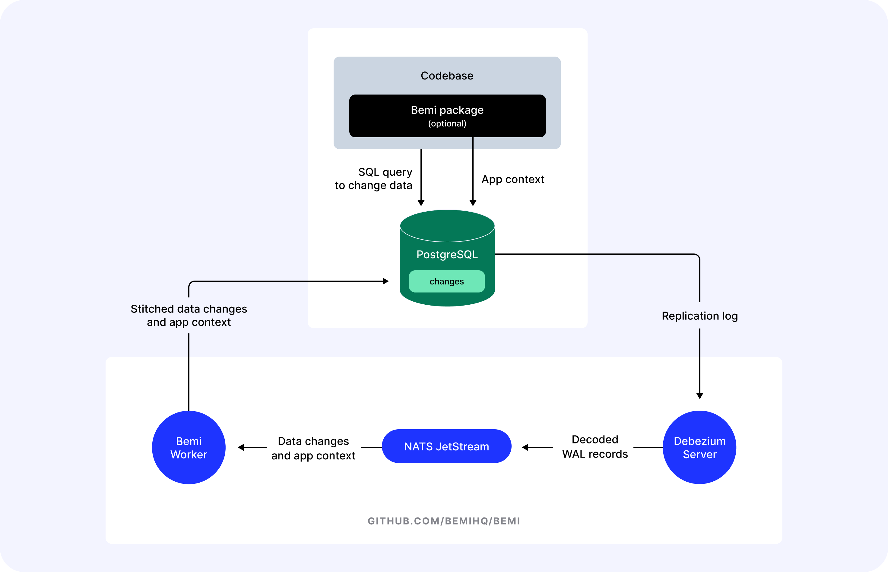

<div align="center">
  <a href="https://bemi.io">
    
  </a>

  <p align="center">
    <a href="https://bemi.io">Website</a>
    ·
    <a href="https://docs.bemi.io">Docs</a>
    ·
    <a href="https://github.com/BemiHQ/bemi/issues/new">Report Bug</a>
    ·
    <a href="https://github.com/BemiHQ/bemi/issues/new">Request Feature</a>
    ·
    <a href="https://discord.gg/mXeZ6w2tGf">Discord</a>
    ·
    <a href="https://twitter.com/BemiHQ">Twitter</a>
    ·
    <a href="https://www.linkedin.com/company/bemihq/about">LinkedIn</a>
  </p>
</div>

# Bemi

Bemi automatically tracks database changes ensuring 100% reliability and a comprehensive understanding of every change. It does it by connecting PostgreSQL's [Write-Ahead Log](https://www.postgresql.org/docs/current/wal-intro.html) (WAL) and implementing [Change Data Capture](https://en.wikipedia.org/wiki/Change_data_capture) (CDC) data pattern. Designed with simplicity and non-invasiveness in mind, Bemi operates in the background and doesn't require any alterations to your existing database tables.

## Contents

- [Highlights](#highlights)
- [Use cases](#use-cases)
- [System dependencies](#system-dependencies)
- [Quickstart for local development](#quickstart-for-local-development)
  - [Running with Docker](#running-with-docker)
  - [Running with Devbox](#running-with-devbox)
  - [Running natively](#running-natively)
- [Contextualizing data changes](#contextualizing-data-changes)
- [Architecture](#architecture)
- [Testing](#testing)
- [License](#license)

## Highlights

- Automatic and 100% reliable database change tracking
- High performance without affecting runtime execution
- Easy-to-use without changing table structures
- Time travel querying and ability to easily filter changes
- Optional application-specific context by using [ORM packages](https://docs.bemi.io/#supported-orms)

## Use cases

There's a wide range of use cases that Bemi is built for! The tech was initially built as a compliance engineering system for fintech that supported $15B worth of assets under management, but has since been extracted into a general-purpose utility. Some use cases include:

- **Audit Trails:** Use logs for compliance purposes or surface them to customer support and external customers.
- **Streaming:** Real-time data stream to an application.
- **Time Travel:** Retrieve historical data without implementing event sourcing.
- **Troubleshooting:** Identify the root cause of application issues.
- **Change Reversion:** Revert changes made by a user or rollback all data changes within an API request.
- **Distributed Tracing:** Track changes across distributed systems.
- **Testing:** Rollback or roll-forward to different application test states.
- **Analyzing Trends:** Gain insights into historical trends and changes for informed decision-making.

## System dependencies

- Node.js
- Java
- [NATS server](https://github.com/nats-io/nats-server)

And of course, you need a PostgreSQL database that you want to connect to to track data changes. Make sure your database has `SHOW wal_level;` returning `logical`. Otherwise, you need to run the following SQL command and restart your PostgreSQL server:

```sql
ALTER SYSTEM SET wal_level = logical;
```

To track both the "before" and "after" states on data changes, please run the following SQL command:

```sql
ALTER TABLE [tracked_table_name] REPLICA IDENTITY FULL;
```

## Quickstart for local development

### Running with Docker

Run a Docker container that connects to your local PostgreSQL database:

```sh
docker run \
  -e DB_HOST=host.docker.internal \
  -e DB_PORT=5432 \
  -e DB_NAME=[YOUR_DATABASE] \
  -e DB_USER=postgres \
  -e DB_PASSWORD=postgres \
  public.ecr.aws/bemi/dev:latest
```

Replace `DB_NAME` with your local database name. Note that `DB_HOST` pointing to `host.docker.internal` allows accessing `127.0.0.1` on your host machine if you run PostgreSQL outside Docker.

Now try making some database changes like:

```sql
UPDATE _bemi_migrations SET executed_at = NOW() WHERE id = 1;
```

This will add a new record in the `changes` table within the same database after a few seconds:

```sql
SELECT "primary_key", "table", "operation", "before", "after", "context", "committed_at" FROM changes;
```

### Running with Devbox

You can install all system dependencies manually or use [Devbox](https://github.com/jetpack-io/devbox) that relies on
[Nix Packages](https://github.com/NixOS/nixpkgs) for providing isolated shells without containerization.
Run a single command that will install Node.js with pnpm and NATS server:

```sh
make worker-install
```

Set environment variables specifying connection settings for a PostgreSQL database you want to track and run a worker:

```sh
export DB_HOST=127.0.0.1 DB_PORT=5432 DB_NAME=postgres DB_USER=postgres DB_PASSWORD=postgres
make worker-up
```

Now try making some database changes like:

```sql
UPDATE _bemi_migrations SET executed_at = NOW() WHERE id = 1;
```

This will add a new record in the `changes` table within the same database after a few seconds.

### Running natively

After installing all system dependencies, install all project dependencies with Node.js:

```sh
make worker-setup && cd worker && npm install
```

Set environment variables specifying connection settings for a PostgreSQL database you want to track run a worker as a single process with directly installed Node.js:


```sh
export DB_HOST=127.0.0.1 DB_PORT=5432 DB_NAME=postgres DB_USER=postgres DB_PASSWORD=postgres
npm concurrently -- "npm:up:*"
```

Now try making some database changes like:

```sql
UPDATE _bemi_migrations SET executed_at = NOW() WHERE id = 1;
```

This will add a new record in the `changes` table within the same database after a few seconds.

## Contextualizing data changes

Optionally, to automatically enhance these low-level database changes with application-specific context (e.g., user ID, API endpoint, etc.), check out our compatible [ORM packages](https://docs.bemi.io/#supported-orms).

## Architecture



Bemi consists of three main parts:

1. [Debezium](https://github.com/debezium/debezium), a very flexible tool for implementing Change Data Capture that is written in Java. It is used by many companies that need to implement ETL such as [Airbyte](https://github.com/airbytehq/airbyte) and [Materialize](https://github.com/MaterializeInc/materialize). We rely on it to be able to connect to PostgreSQL replication log, perform logical decoding, and send raw data to a data sink.
2. [NATS JetStream](https://github.com/nats-io/nats-server), a cloud-native messaging system written in Go. Debezium is historically designed to send data to Kafka, but it can be also re-configured to send data to NATS JetStream. It is much more lightweight and easy to manage while being very performant and having over 45 clients for different programming languages.
3. Bemi Worker, a process responsible for stitching data change with app context sent via our open-source [ORM packages](https://docs.bemi.io/#supported-orms) and storing data changes. It is written in TypeScript and uses the `core` that we rely on for our [Bemi](https://bemi.io/) cloud platform.

The described architecture and the `worker` code in this repository are a simplified version that can be easily run without much overhead.
If you want to self-host it in a production environment, see our [self-hosting docs](https://docs.bemi.io/self-hosting).
Alternatively, [sign up](https://dashboard.bemi.io/log-in?ref=gh) with your GitHub login to use Bemi Cloud.

## License

Distributed under the terms of the [SSPL-1.0 License](/LICENSE). If you need to modify and distribute the code, please release it to contribute back to the open-source community.
